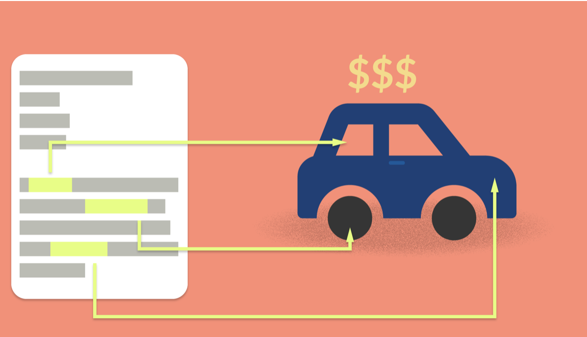
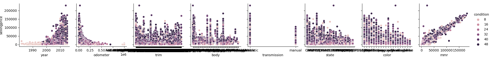
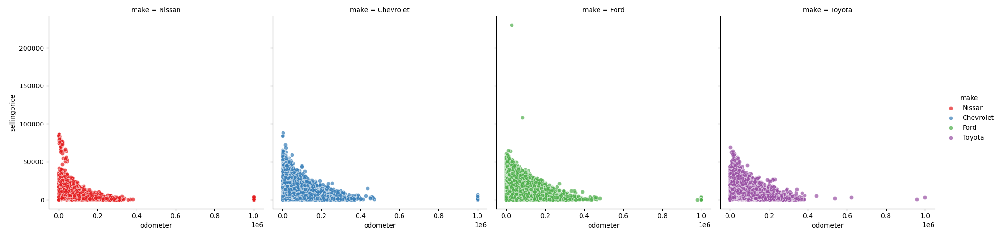
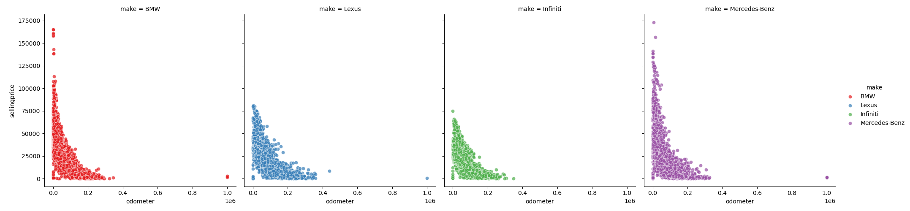
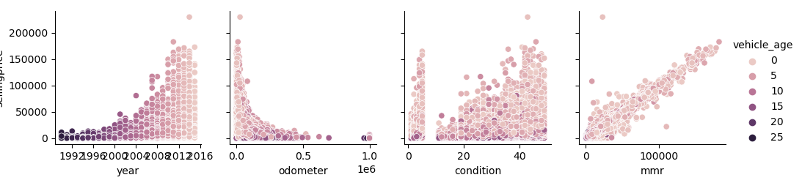

<<<<<<< HEAD
# Price_Predictions

=======
# Car Price Predictions
>>>>>>> 6a2c46c7e2cb73fe62214c41ca689bc261cf9c81

# Overview

<<<<<<< HEAD
#### Our capstone project is focused on predicting vehicle prices using machine learning. Our goal is to build a web application that accurately predicts vehicle prices based on inputs using our machine learning models. The specific models we used for this project are Lasso Reggression, Linear Regression, and Principal Componenet Analysis. To develop our model we used correlation to see how each variable impacted the vehicle selling price.  Once we explored the data and selected variables we ran our models to see which variables were the most "important" to include in our web app to predict the sellingprice.

## Getting Started 

#### Step 1. Import the required libraries and read in:

##### Libraries imported pandas, hvplot, pathlib, numpy, matplotlib.pyplot, seaborn, streamlit, pickle, sklearn, statsmodels.stats.outliers_influence, statsmodels.api. Then we read in the CSV file `car_prices`.

#### Target and Feature Variables:

##### Target Variable: Sellingprice
##### Variables: Year, Make, Model, Trim, Body, Transmission, Vin, State, Condition, Odometer, Color, Interior, MMR(wholesale price), seller, saledate.

#### Step 2: Exploratory Data Analysis 

##### In our project, we performed Exploratory Data Analysis (EDA) to examine the relationships between various variables and the target variable 'Sellingprice'. Utilizing a pair grid, we compared the variables 'year', 'odometer', 'trim', 'body', 'transmission', 'state', 'color', and 'mmr' with the target variable 'Sellingprice', setting the hue to 'condition'. Almost immediately, a positive correlation between selling price and 'mmr' became apparent.

##### Further investigation into the impact of transmission on selling price revealed that automatic transmissions commanded a higher selling price compared to manual transmissions. The distribution of the target variable exhibited right skewness, indicating the presence of outliers in our dataset. Recognizing that certain car makes significantly influenced the selling price, we opted to categorize the data into two groups: 'non-luxury' and 'luxury' cars.

* Non_Luxury_Cars

* Luxury_Cars

  
#### Step 3: Preprocessing and Cleaning the Dataset

##### Following the completion of our Exploratory Data Analysis, we removed the 'vin' and 'seller' variables from our dataset, deeming them nonessential. Furthermore, we engineered a new variable named 'vehicle_age' by converting the 'saledate' and 'year' columns to datetime format and calculated the difference between the vehicle's year and the sale date. Subsequently, we utilized a Pairgrid to visualize correlations between 'selling price' and other variables with respect to 'vehicle_age'. Notably, we observed negative correlations between vehicle age and the variables 'year', 'mmr', and 'sellingprice'.

#### Step 4: Prepare the Dataset for training and testing the models.

##### We partitioned and scaled our numerical target and feature variables, while encoding the categorical variables within our dataset. Given the dataset's size, we narrowed our focus to the top 15 most frequently sold car makes. Within this refined dataset, we excluded 'saledate', 'trim', 'interior', 'year', 'body', and 'transmission' variables. Our data analysis revealed that these variables had a lesser impact on the selling price compared to other features.

#### Step 5 : Machine Learning Algorithms

##### We did a fit and predict using our variables for the models. 
##### Lasso Regression: 
* R2 Score: 0.9662719462364295
* Mean Absolute Error: 1030.0036412381942

##### Linear Regression:
* R2 Score: 0.966272087314783
* Mean Absolute Error: 1030.003265618789

##### For the Principal Component analysis we multiplied the explained variance ratio results by 100 to get a percentage of the results.
* First Principal Component (PC1): 96.37%
* Second Principal Component (PC2): 3.58%
* Third Principal Component (PC3): 0.05%
* Fourth Principal Component (PC4): 0.0005%
* Fifth Principal Component (PC5): 0.000005%
* Sixth Principal Component (PC6): 0.0000000526%
* Seventh Principal Component (PC7): 0.0000000387%
* Eighth Principal Component (PC8): 0.0000000158%
* Ninth Principal Component (PC9): 0.00000000668%

#### Conclusion 
##### In conclusion, our analysis demonstrated that Linear and Lasso Regression models outperformed others in predicting vehicle prices accurately. Upon selecting these models, we proceeded to encode and scale the variables for integration into our web application. However, we encountered challenges in eliminating certain underperforming features from the model, as they were essential inputs for our web application's functionality. Despite this hurdle, we diligently defined the features and generated inputs tailored for our web application's requirements.

#### Resources
* https://www.kaggle.com/datasets/syedanwarafridi/vehicle-sales-data

=======
## Overview
Our capstone project is focused on predicting vehicle prices using machine learning.  Our goal is to build a web application that accurately predicts vehicle prices based on inputs using our machine learning model.  To develop our model we used correlation to see how each variable impacted the vehicle selling price.  Once we explored the data and selected variables we ran a Linear Regression, Lasso Regression, and Principal Componenet Analysis to see which provided the most accurate results for use in our application.  

## Instructions
   1.  Clean the data, removing irrelevant/null information
   2.  Explore the data checking values/types
   3.  Look for correlation between our target and feature variables
   4.  Seperate and scale our target and feature variables
   4.  Fit and predict using our variables and the Lasso/Linear Models
   5.  Analyze prediction metrics and decide which model will provide the best results
   6.  After model selection we need to encode the scaled variables for our web application
   7.  We then need to define the features and create inputs in our web app
   8.  Using the encoded variables and feature inputs our imported model will predict the price of the vehicle.
   
## Conclusion
   Both the Linear and Lasso Regression models did a good job at predicting vehicle prices.  The r2 score for both models was just shy of 1.0.  It was difficult to eliminate some of the underperforming features from the model because they were necessary for inputs in our web application.  Overall the model accurately predicts vehicle prices granted the inputs make sense.
>>>>>>> 6a2c46c7e2cb73fe62214c41ca689bc261cf9c81
   
   
